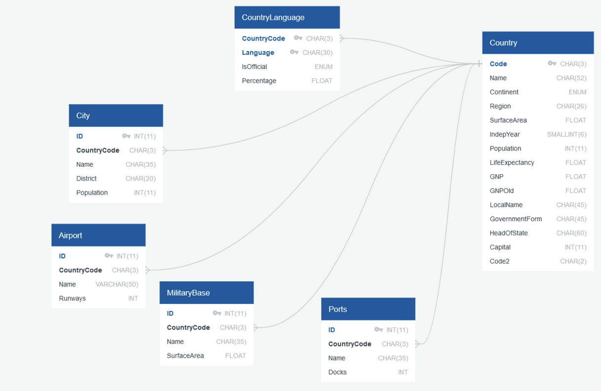

# Country Database

A MySQL country database creation script with queries for data retrieval.

## Table of Contents

1. [Getting Started](#getting-started)
2. [Documentation](#documentation)
   - [Physical Model](#physical-model)

## Getting Started

- database.sql: copy/paste the lines into MySQL and execute to create the database.
- queries.sql: copy/paste a query and execute in MySQL to retrieve data.
  > [!NOTE]  
  > MySQL will only run the selected text. Highlight a query and execute 1 at a time.

## Documentation

This database originally had the Country, CountryLanguage, and City tables, but this project extends the database by creating the following tables:

- **Airports**: provides information about every known airport, identifying methods of travel to and from a country.

- **MilitaryBase**: provides information about every known military base, identifying potentially active military zones.

- **Ports**: provides information about every known port, identifying supply routes to and from a country.

By adding these tables, the database can now be queried to retrieve information about powerful nations. This functionality could be used to evaluate threat levels of potentially hostile nations to help provide national security.

### Physical Model

The physical model displayes the primary/foriegn key relationships and each table's attributes.
